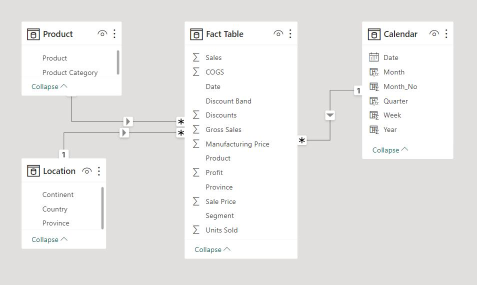
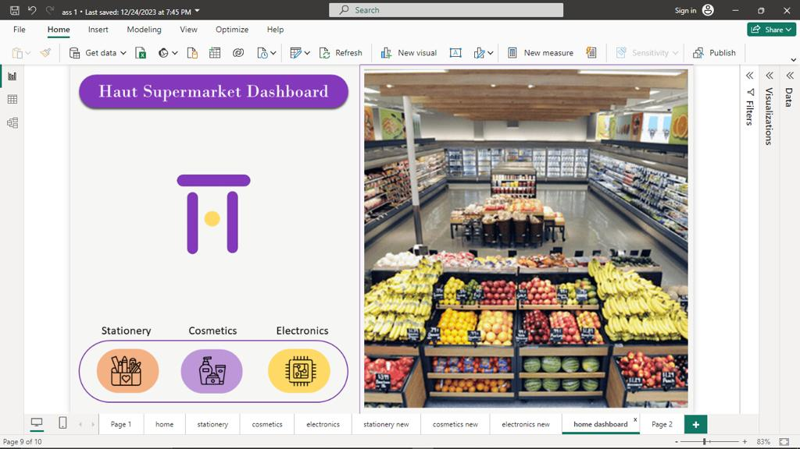
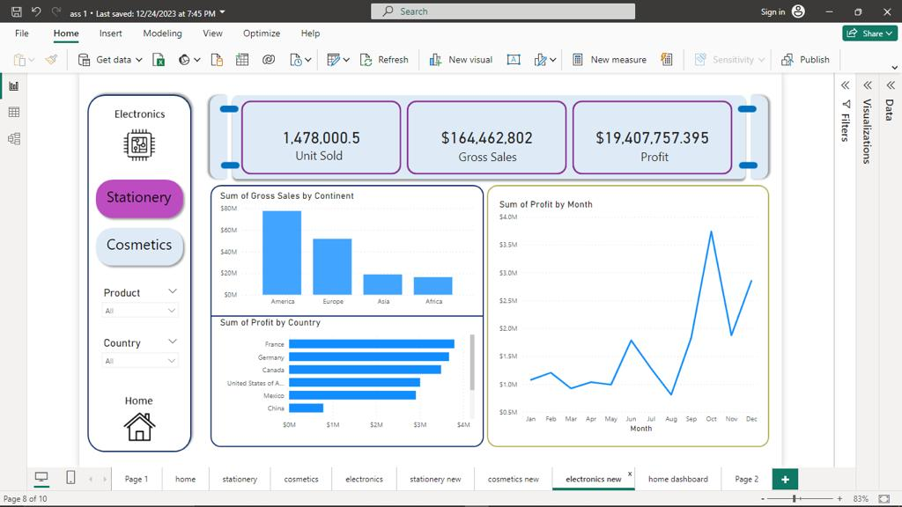
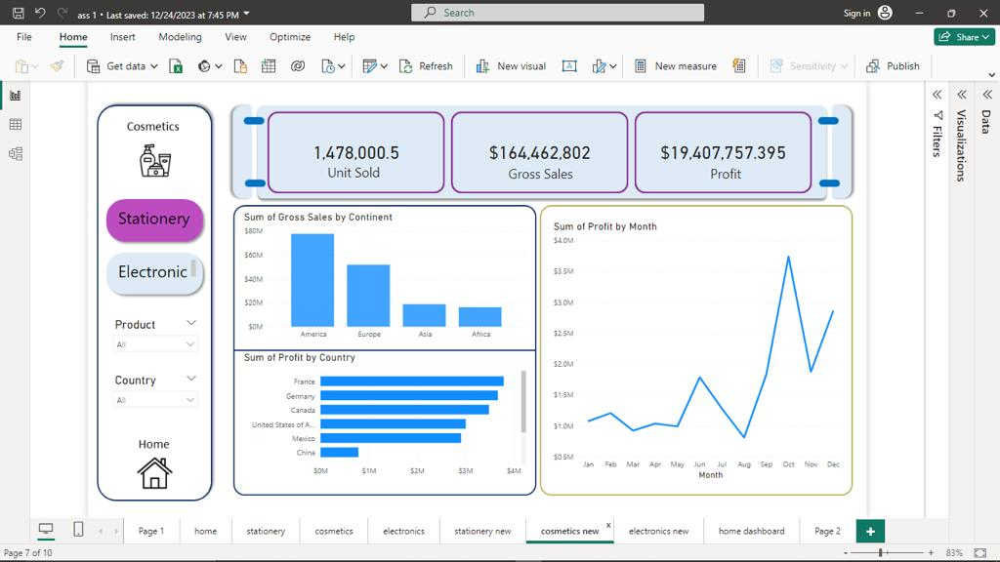
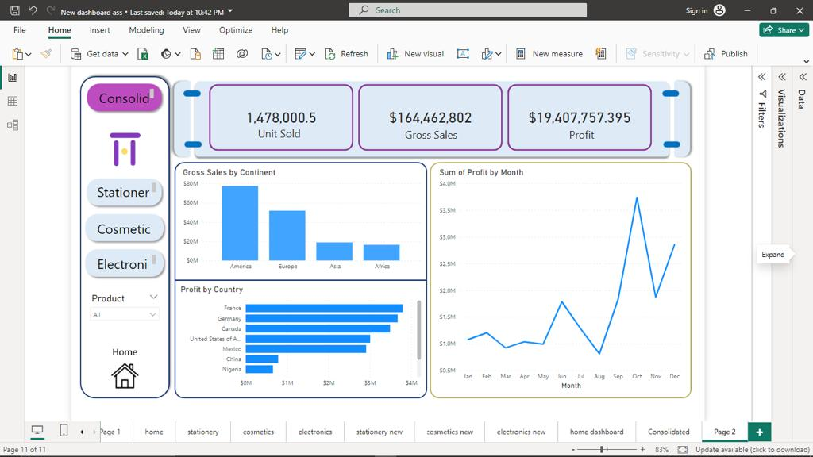

# Haut Supermarket Dashboard

<!--  -->
##  Introduction
This is a power Bi project on profit and sales made from haut supermarket. This project is targeted to analyze and draw insights to answer crucial questions in other to help the supermarket make data driven decisions.

## Problem Statement
This project is aimed at improving business performance at Haut Super market and hence, answering the following questions
1. Which country is having the highest profit?
2. Which product category is the most and least profitable?
3. What is the profit ratio of the years under review?
4. Where does most sales come from in term of region?
5. What is the performance of the Africa market relative to other continents?

## Data Source:
The data is a modified dataset known as financial sample
* Modified Dataset used in this Project [DownloadModifiedDataset](https://docs.google.com/spreadsheets/u/1/d/106zJMf0DuyiR4uSU0ldLB31Z1U9Q5JWU/htmlview#gid=558144861)

## The following are the power Bi skills demonstrated:
+ Project Planning and Documentation
+ Data Analysis Expression (DAX)
+ Scalability
+ Page navigation and button
+ Data Modeling
+ Data Visualization
+ Report Design
+ Performance Optimization
  
## Data Modelling
During the process of data visualization and dashboard creation, two tables were created in power Bi named the fact table and the dimension table. There is one fact table and Two-dimension tables
The fact table and dimension table are comprised of the following columns from which the primary and foreign keys are derived.
  

## Report Design and Visualization
TThe report canvas was designed in power point and imported into power BI as canvas background, Here is a sample of the design in power point.  
Five pages were created namely;
•	the home pages
•	consolidation page
•	stationery page
•	cosmetic page
•	electronic page

The Home page displays the supermarket name, logo and icons to other pages. From the home page users can navigate through other pages; the stationery page, cosmetic and electronic page.

  

<!-- | Visuals             |  Visuals |
:-------------------------:|:-------------------------:
| 
 |  -->

The Electronic Page displays the unit products sold, gross sales and the profit made from the sales of electronics, right at the top of the page
It also shows the analysis of the sum of sales made by each 
continent, profits made by all the countries and the profit made per month.

 

The Cosmetic Page displays the unit products sold, gross sale made from cosmetics and, profit made from the sales of cosmetics, right at the top of the page.
It also shows the analysis of the sum of sales made by each continent, profits made by all the countries and the profit made for each month.

 

The Stationery Page displays the unit products sold from stationery products, gross sales, and the profit made from the sales of stationery, right at the top of the page
It also shows the analysis of the sum of sales made by each continent, profits made by all the countries and the profit made per month.

 

Consolidated has the general report without filter while other pages has filtered reports accroding to their page name. On each page, the new card visual is used to hold Total Sales, Gross Sales and Profit, Line Chart is used for the series analysis while a column and bar chart are adopted for the Continental and Country analysis respectively

 

## Inference
The data analysis revealed that;

•	France is the most profitable country among all the Haut countries
•	The most and least profitable product category are stationery and cosmetic which amount to 44% and 28% of the total profit respectively 
•	There is an increase in the profit from year 2013 to 2014 with a ratio of 4:6
•	By region continent, the Haut supermarket makes the most sales from America region with $98M of the total gross sales
•	Africa pull 9% of the total Gross sales and 6% of the total profit from 202,286 units sold from south Africa and Nigeria. This can be visualized when clicking on Africa in the column chart.

## Conclusions and Recommedations

•	Haut’s management should continue their market strategy that leads to higher profits and better customer satisfaction
•	The cosmetics product category demands more research and development to boost its sales and profitability
•	Promotions (discounts) drive most of the sales in Haut stores, making them competitive in the dynamic market. Therefore, other promotional and marketing strategies should be implemented to enhance sales and profit
•	Products in Africa and China stores should be tailored to the specific needs of these markets through careful research.

<!-- ## Deployment to Power BI Service
This Report is deployed to Power BI service from my Microsoft developer account and publish to the web for everyone to have access to it.
[HautSupermarketAnalysis](https://app.powerbi.com/groups/me/reports/66ab0071-4b25-41c8-99fd-fd006603aacd/ReportSection6239a8326550e132bae6?ctid=32796be2-60fb-4da2-8d26-06e5938e6e6b&experience=power-bi)  

To Open a developer Microsoft account, kindly check this article [OpenMicrosoftdeveloperaccount](https://techcommunity.microsoft.com/t5/educator-developer-blog/register-for-microsoft-365-and-power-apps-developer-account-with/ba-p/3490280)

Thanks for taking time to go through this report! 🤝 -->

